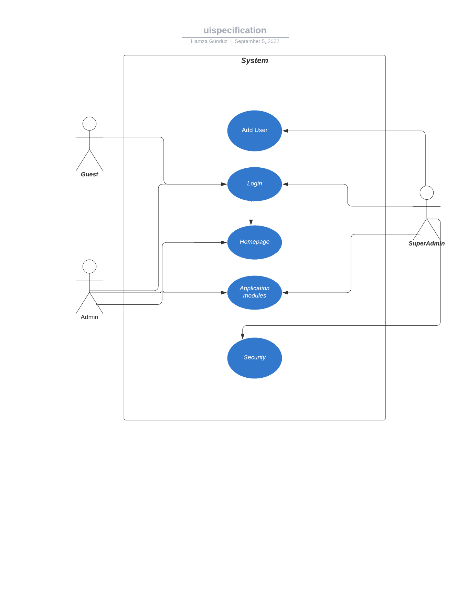

<h2 align="center"> User Interface Specification</h2>

|| Headlines|
| ------ | ------ |
|1 |[Visual overview](#1)|
|2 |[Display rules](#2)|
|3 |[Steps](#3)|
|4 |[Links, signs, and icons](#4)|
|5 |[Use case diagram](#5)|

### 1 - Visual overview 

>This user interface specification only contains user management screen details. First part contains a description the visual style of page and tools that are using for.

- As we consider the screen rectangular on the left top of the screen there is an "New User" button.  
- Beside the button there is a "Hide Disabled User" checkbox
Under these two tools there are database table witch contains "Id, User Name, Email and Enabled". This database table begins at left of the page and covers half of the page horizontally.
- On the right side of page there is a register part. This part contains "Username, Display Name, Phone, Email, User Roles, Enabled" vertically. User Roles is a drop down, contains; "Guest, Admin, SuperAdmin" and Enabled is a checkbox area. The rest of them are textbox area. 
- Right over this register page is a "Save User" button.

### 2 - Display rules 
##### 2.1 New User
- Is a Push button that display New User page when clicked on it.
##### 2.2 Username
- Textbox area that allows user to enter any data
##### 2.3 Display Name
- Text box area that allows user to enter any name that he wants to be pronounced in business
##### 2.4 Phone
- Text box area that allows user to put a phone number that belongs to them
##### 2.5 Email
- Text box area that allows user to enter an email that related to the them

##### 2.6 User Roles
- Drop down area that have 3 options allows user to choose the role of the user between 'Guest, Admin, Super Admin'
##### 2.7 Enabled
- Checkbox that using for user activation.
##### 2.8 Save User
Is a Push button saves the user when clicked on it.
##### 2.9 Hide Disapled User
- A checkbox hide users where their Enabled area is false when clicked on it.

### 3 - Steps of usage
This section will explain how the user management page can use.
- The user management page firstly shows to the user New user button, Hide Disabled User checkbox, User lists and Save User button. The Save User button is closed at first.
- When is clicked on the New User button the New User page will open.  
- The user will fill the requirements begining with the username. Username is an identity name that every user have their unique username. No one can have the same username.
- After the user will fill display name, phone number, email and UserRole. 
- There are three user roles
    - Guest can only have an access to the home page.
    - Admin have an acces to the application modules except security
    - Super Admin have unrestricted access
- One of the three is selected according to the qualification of the user.
- And the last one is Enabled checkbox. When it clicked it enables the user for acces.
- When all of properties are filled the Save User button get active.
- After that when the Save User is clicked New User will be successfully added to the database.
- On the left side the new user will appear on the users table. 
- When Hide Disabled User is clicked the users that not enabled will hide on the database.

### 4 - Links, signs, and icons Attributes
* Textbox = Input
* Drop down = Select
* Check boxes = Click
* Push button = Click

### 5 - Use case diagram

##### Hamza GÜNDÜZ
